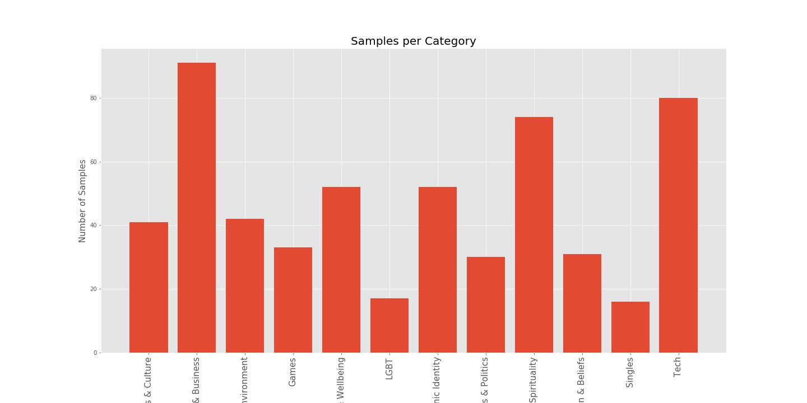
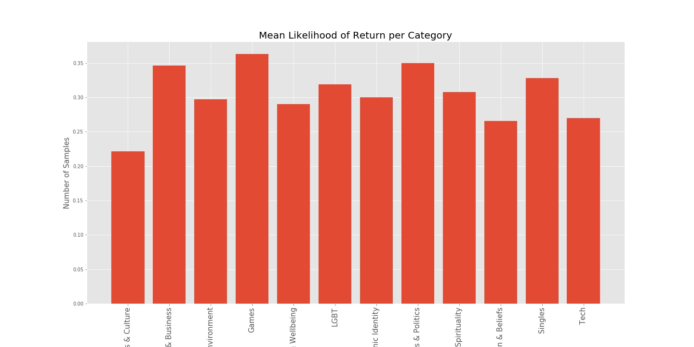
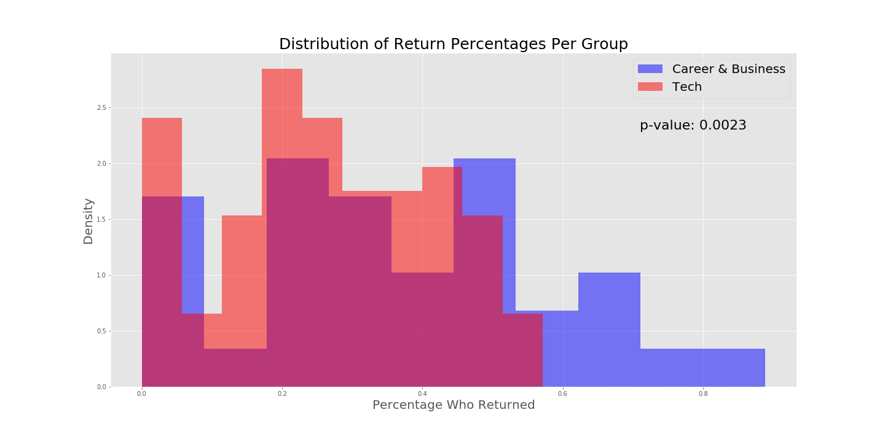
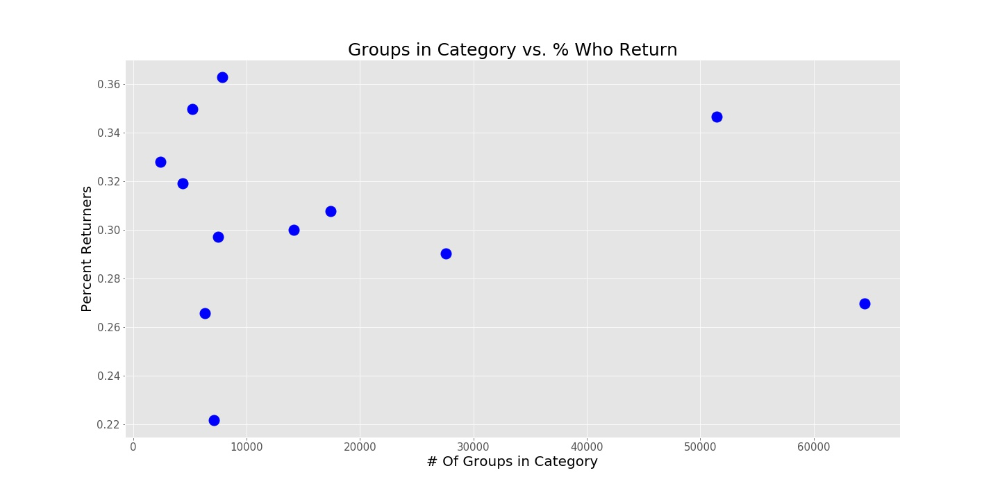
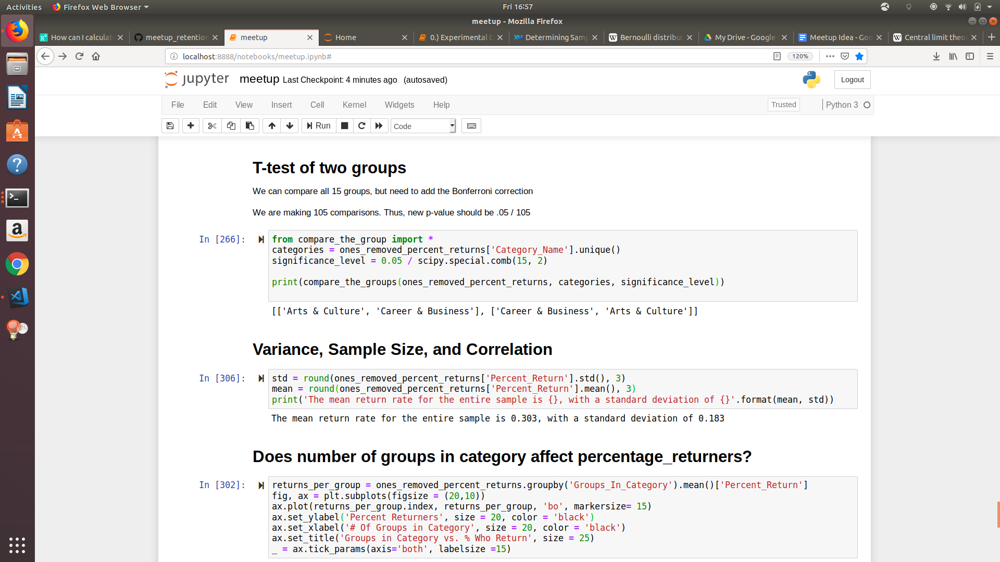

*BACKGROUND*

* There are nearly 350,000 Meetup groups globally. Around 82% of their information is public.

* The groups are organized into 33 different categories, such as Arts and Culture, Business, or Singles. 

*QUESTION*

Meetup provides plenty of information about how many people attend a particular event. However, I am more interested in whether those people come back.

Can we calculate the *retention rate* of a particular Meetup group? I.e., if I attend an event with this group, am I likely to come back? 

Will this average retention rate differ based off of Meetup category?

*HYPOTHESIS*

1. I hypothesize that groups in different Meetup categories will have different percentages of returners. 

2. I also hypothesize that this will be inversely correlated to the 'popularity' of that category. In other words, I hypothesize that the more popular a group, the lower its retention. 

*NULL HYPOTHESIS*

There will be no difference in % returner rates per category.

*METHODS*

1. For a meetup group, create a list of all the people who ever attended one of its events. Select from this list only the members who returned. Divide the length of the returners list by the length of the attenders. 

2. Each member can be thought of as a single Bernoulli trial, where success is returning. We thus create a binomial distribution for each group.

2. Take average of the groups for each Meetup category.

3. Conduct statistical tests to compare retention rates per category. Perform Bonferroni correction to correct p-values for multiple comparisons. 

4. Inspect whether popularity of category inversely correlates with retention rate.

